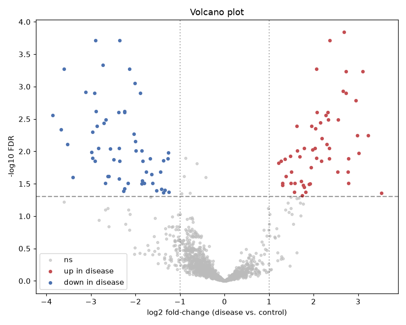

# Differential Gene-Expression Analysis (RNA-seq, case vs. control)

Finding the genes that change between two biological conditions — the standard
first read-out of a transcriptomics experiment. Full pipeline: **count
normalization → PCA / QC → per-gene differential-expression testing with
multiple-testing correction → volcano plot & clustered heatmap → validation
against ground truth**.

Draws on the molecular-biology and neuroscience research I did at UC Irvine,
reframed as a reproducible statistical pipeline.

## Analysis

1. **Normalize** — low-count filter, counts-per-million (CPM), log2 transform.
2. **PCA** — control vs. disease separate cleanly along PC1: a real global signal.
3. **Differential expression** — Welch's *t*-test per gene + **Benjamini-Hochberg
   FDR** to control false discoveries across ~2,000 simultaneous tests.
4. **Volcano plot & clustered heatmap** — reduce 2,000 genes to a defensible
   shortlist; disease samples cluster apart from controls on the top DE set.
5. **Ground-truth validation** — the data is synthetic, so true DE genes are
   known.

## Result

At FDR < 0.05 and |log2FC| > 1 the pipeline calls **112 genes** with:

| Metric | Value |
|---|---|
| True positives | 109 |
| False positives | 3 |
| Empirical FDR among calls | **2.7%** (target < 5%) |
| Sensitivity (recall of true DE genes) | 0.61 |
| log2FC recovery (est. vs. true) | **r ≈ 0.97** |

The FDR is correctly controlled and fold-changes are recovered accurately.
Sensitivity is bounded by effect size — the missed genes are small-fold-change
ones near the detection limit with 6 replicates per group, exactly as expected.



## Data

All data is **synthetic**, generated with a fixed random seed by
[`generate_data.py`](generate_data.py): a 6-vs-6 case-control design over ~2,000
genes with realistic baseline expression, per-sample library-size variation, and
**negative-binomial** (over-dispersed) count noise. A known subset of genes is
truly differentially expressed with defined log2 fold-changes. No real sequencing
data is used; the generator is committed for reproducibility.

```bash
python generate_data.py     # writes data/counts.csv, sample_info.csv, gene_truth.csv
```

**Methods note:** production RNA-seq uses negative-binomial GLMs (DESeq2 / edgeR).
This project uses a transparent CPM + log2 + Welch *t*-test + BH-FDR pipeline —
the same statistical logic, built from first principles.

## Skills demonstrated

- High-dimensional statistical testing and **multiple-testing correction (FDR)**
- Count-data normalization (CPM, log2)
- Dimensionality reduction (**PCA**) and unsupervised **clustering**
- Volcano / heatmap visualization for genomics
- Validating an analysis pipeline against ground truth

## Run it

```bash
pip install -r requirements.txt
python generate_data.py
jupyter lab      # open differential_gene_expression.ipynb
```
